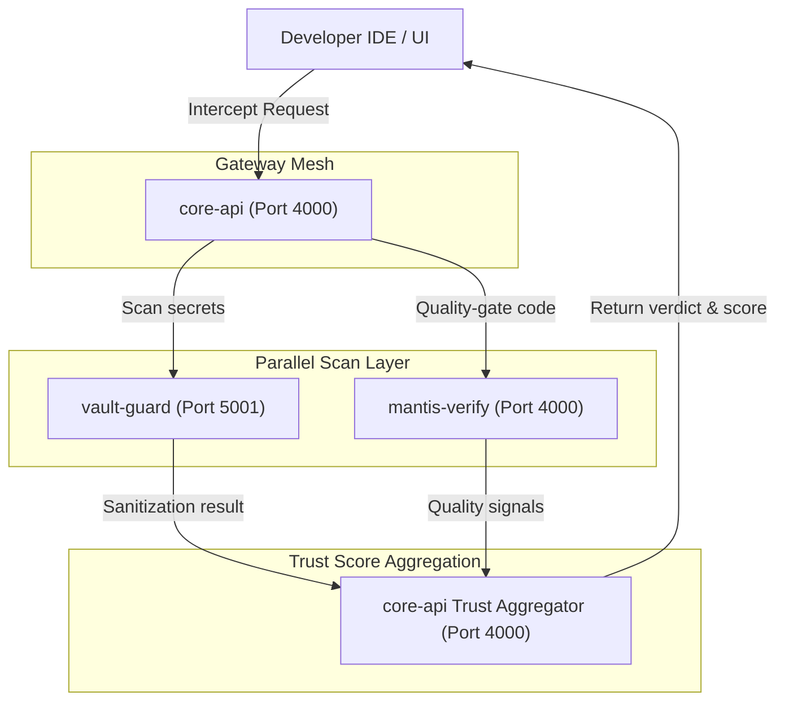

# DeployMantis

DeployMantis is a self-hosted AI gateway for engineering teams that intercepts, scans, and quality-gates every AI-generated output before it reaches your codebase.

## Why DeployMantis

- Secret scanning (Vault-Guard)
- AI quality gating (MantisVerify PASS/WARN/FAIL)
- Per-tenant budget enforcement (Token-Breaker)

## Quick Start

For detailed setup instructions, see [QUICKSTART.md](file:///c:/Users/traps/Downloads/ResumeProjects/AI-Suite/QUICKSTART.md). Run these three commands to get started:

```bash
cp .env.example .env
make up
make key
```

## Architecture



When a developer IDE or UI sends a request, it enters the gateway mesh through `core-api` on Port 4000. The gateway parses auth rules, verifies billing thresholds, and forwards the payload in parallel to the scan layer: `vault-guard` (Port 5001) runs secret scanning and PII redaction, while `mantis-verify` (running on `core-api` Port 4000, calling `mantis-graph` on Port 5003) analyzes AST conventions and risk profiles. The results are unified by `core-api`'s trust score aggregator to calculate a final PASS/WARN/FAIL verdict before responding to the client.

## Feature Status

| Feature | Status | Description |
|---------|--------|-------------|
| MantisSnap | ✅ Shipped | Branch context time machine — instant recall of what you were working on |
| MantisVerify | ✅ Shipped | AI diff quality gate — returns PASS / WARN / FAIL with reasons |
| MantisLaunch | ✅ Shipped | One-tap environment orchestrator with drift detection |
| Vault-Guard | ✅ Shipped | Zero-trust secret masker and credential scanner |
| Token-Breaker | ✅ Shipped | Per-tenant LLM budget enforcement |
| Trust Score UI | 🚧 Building | Visual PASS/WARN/FAIL badge on every response in the dashboard |
| Stripe Billing | 🚧 Building | Hobbyist / Developer / Team subscription tiers |
| PostgreSQL Layer | 🚧 Building | Multi-tenant asyncpg database with SQLite fallback |
| MantisHeal | 📋 Planned | Self-healing CLI — classifies errors, proposes safe fix commands |
| MantisDiff | 📋 Planned | Git diff interactive storyteller — maps changes to behaviour bullets |
| MantisDiscovery | 📋 Planned | PR impact blueprint — maps feature descriptions to affected files |
| MantisBrand | 📋 Planned | Portfolio case study engine from completed feature logs |

## Pricing

| Plan | Price | Seats | Features |
|------|-------|-------|----------|
| Hobbyist | Free | 1 | MantisSnap, MantisLaunch |
| Developer | $19/mo | 1 | + MantisVerify, MantisHeal |
| Team | $39/user/mo | Unlimited | All features + audit logs |

## Links

- Full setup: [QUICKSTART.md](file:///c:/Users/traps/Downloads/ResumeProjects/AI-Suite/QUICKSTART.md)
- Architecture deep-dive: [docs/architecture.md](file:///c:/Users/traps/Downloads/ResumeProjects/AI-Suite/docs/architecture.md)
- Contributing: [CONTRIBUTING.md](file:///c:/Users/traps/Downloads/ResumeProjects/AI-Suite/CONTRIBUTING.md)
