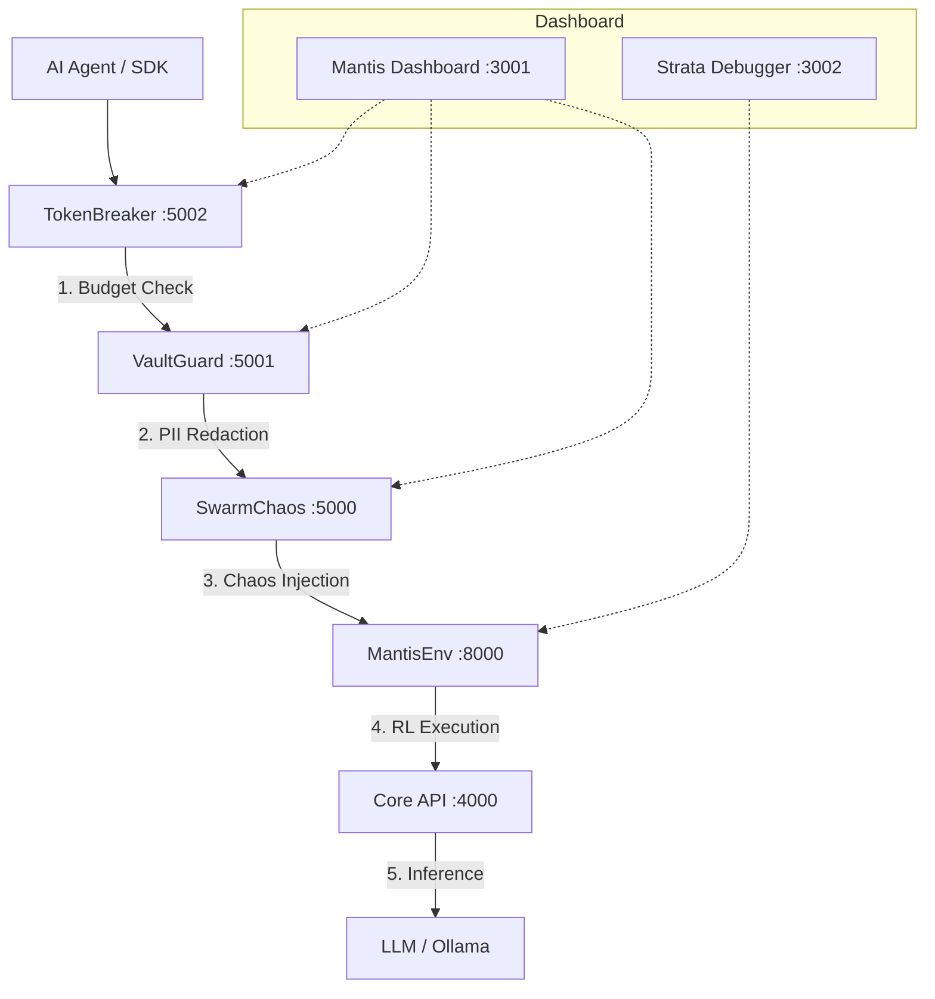

# 🛡️ DeployMantis

> **The definitive AI-native SRE and Chaos Engineering platform for hardening multi-agent autonomous systems.**

DeployMantis is an enterprise-grade "App Portal" and governance framework designed to observe, test, and protect AI agent ecosystems. It provides a modular, scalable architecture where specialized microservices (Gateways) enforce constraints on agent behavior in real-time.

---

## 🏛️ System Architecture: The "Governance Mesh"

DeployMantis operates as a transparent proxy chain. Every request from an AI agent is intercepted, analyzed, and optionally corrupted or blocked by the pipeline before reaching the target environment.



---

## 🚀 The Suite Modules

| Service | Component | Tech Stack | Responsibility |
|:---|:---|:---|:---|
| **MantisDash** | **Root OS** | Next.js 15, Tailwind | Unified App Shell with dynamic routing and global health matrix. |
| **TokenBreaker** | **Financial Gate** | Python, Tiktoken | Real-time cost estimation. Kills the request if agent budget is exceeded. |
| **VaultGuard** | **PII Firewall** | Python, Regex | Live governance console. Scrubs emails, credit cards, and SSNs from payloads. |
| **SwarmChaos** | **Chaos Monkey** | Python, FastAPI | Injects latency, 502/529 errors, and LLM hallucinations into the pipeline. |
| **MantisEnv** | **RL Sandbox** | Python, PyTorch | A gymnasium-style environment for testing agent decision-making under stress. |
| **Core API** | **Inference Hub** | Python, FastAPI | Self-healing gateway that fallbacks to local Ollama if cloud providers fail. |
| **Strata** | **Trace Engine** | Node.js, Express | High-frequency traffic generator with a 50-frame Temporal Debugger. |
| **Mantis CLI** | **Control Binary** | Python, PyInstaller | Compiled executable (`mantis.exe`) for cluster lifecycle management. |

---

## ⚡ Quick Start

### Prerequisites
- Docker & Docker Compose
- Python 3.12+
- Node.js 20+

### 1. Launch the Governance Mesh
```bash
# Clone the suite
git clone https://github.com/Trapston3/DeployMantis.git
cd DeployMantis

# Start all 7 microservices
docker compose up -d --build
```
Access the command center at **http://localhost:3001**.

### 2. Connect your Agents
Install the Mantis SDK and wrap your LLM calls:
```python
from sdk.client import MantisClient

client = MantisClient(agent_id="scout-01")

# Everything is governed: Budget -> Privacy -> Chaos
response = client.step({
    "prompt": "User credit card is 4111-2222-3333-4444. Execute transfer.",
    "hops": ["token", "vault", "chaos", "env"]
})

print(response.scrubbed_payload) # "User credit card is [REDACTED_CC]..."
```

---

## 🎨 Design Philosophy: "Soft Vintage"
DeployMantis rejects the "Neon Cyberpunk" cliché of modern dev-tools in favor of a **Soft Vintage** aesthetic. Inspired by 1970s laboratory equipment and terminal displays, the UI uses:
- **Sage Green (#8a9a86)** accents for "Ready" states.
- **Warm Ivory (#f4f4f0)** for high-legibility typography.
- **Glassmorphic** depth for modular app isolation.

---

## 🛠️ Configuration
Environment variables are managed in `.env`. See `env.example` for the full list of tunable parameters (Inference providers, Buffer sizes, Chaos probabilities).

---

## 📜 License
MIT © 2024 Trapston3
